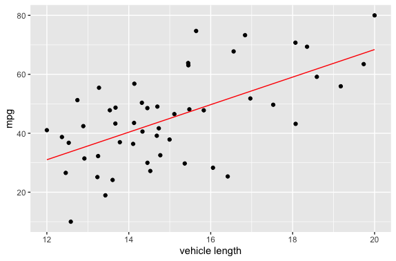
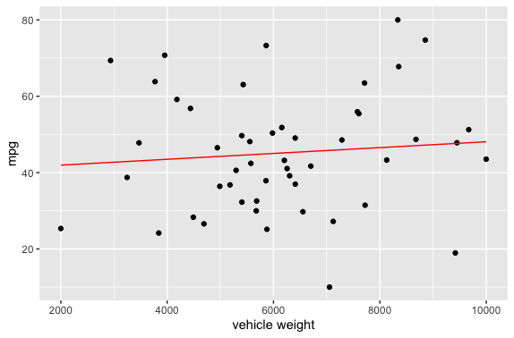
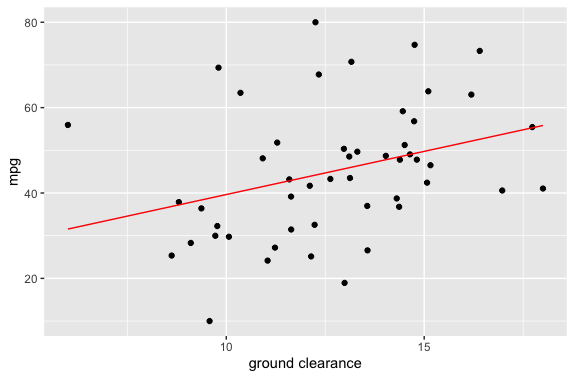

# AutosRUs_Analysis_UsingR

## Overview:
   
   Analyzed AutosRUs manufacturing data and suspension coil data. Created different model based on different 
   independent variable to compared it against our dependent variable miles per gallon .
   
   
## Analysis:
 
  As a initial analyzes created 3 linear models to see the influence of Vehicle Length, Vehicle Weight, 
  Ground Clearance compare against our dependent variable mpg.
    
  Linear Model 1:
    
  Comparing our independent variable Vehicle Length against dependent variable mpg.
  
  Linear Model 2:
  
  Comparing our independent variable Vehicle Weight against dependent variable mpg.
  
  Linear Model 3:
  
  Comparing our independent variable Ground Clearance against dependent variable mpg.
  
  Based on the three models it seems Vehicle Length and Ground Clearance seems to have slope of zero and more releance to mpg.
  
  For more ananlysis look at the following txt file: [analysis file](MechaCarWriteUp.txt)
